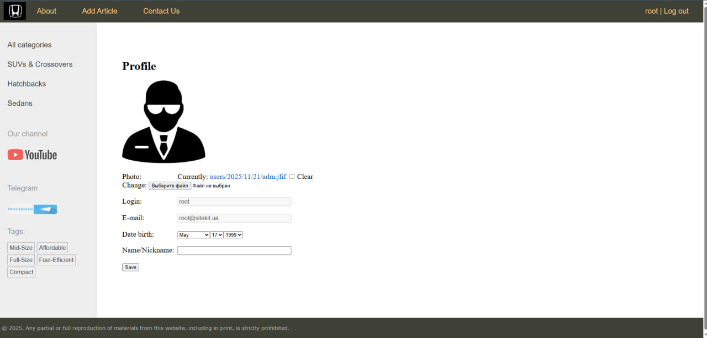
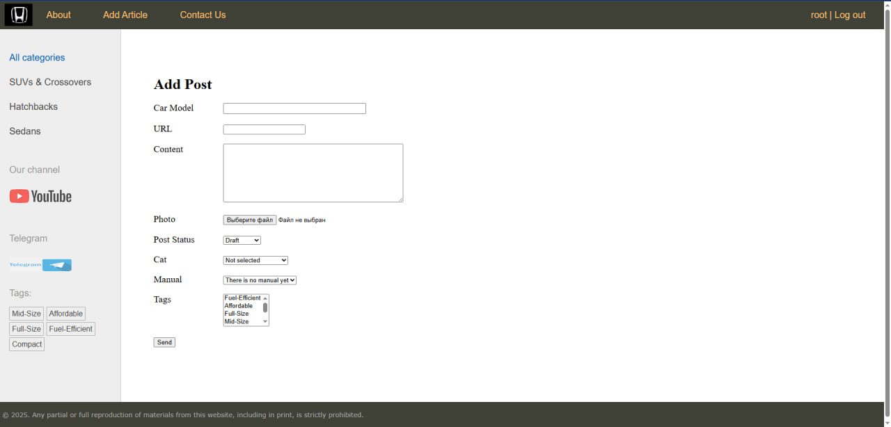

# SiteKit - Django Web Application (Educational Project)

SiteKit is an educational Django-based web application developed as part of professional training.  
The project represents a fully functional informational website about automobiles and demonstrates backend development skills using modern industry practices.

---

## 🚀 Features

- User registration and authentication
- OAuth 2.0 authentication via GitHub
- Role-based access control
- CRUD functionality for core entities
- Custom admin panel for content management
- REST API built with Django
- Caching with Redis
- PostgreSQL as the main database
- Dockerized environment for development and deployment

---

## 🛠 Tech Stack

- **Backend:** Python, Django
- **Database:** PostgreSQL
- **Cache:** Redis
- **Web Server:** Nginx
- **Containerization:** Docker, Docker Compose
- **Authentication:** Django Auth, OAuth 2.0 (GitHub)
- **Admin tools:** Django Admin, Adminer
- **Testing:** unittest

---

## 📦 Project Architecture

- Django application running via Gunicorn
- Nginx as a reverse proxy
- PostgreSQL and Redis as separate services
- All components orchestrated with Docker Compose

---

## ⚙️ Local Setup (Docker)

### Prerequisites
- Docker
- Docker Compose

### Run the project
```bash
docker compose up --build
```

After startup, the application will be available at:

http://127.0.0.1

---

##  🧪 Testing


Unit tests are written using Python’s built-in unittest framework.


---

## 📌 Notes

- `.env` file is excluded from the repository for security reasons
- Media files and database volumes are not tracked by Git
- The project is intended for educational and portfolio purposes

---

## 👤 Author

Developed by Oleksii Voskoboinyk
Junior Python / Django Developer


## 🖼 Screenshots

### Homepage


### Authentication


### Admin Panel


### Admin Panel2


### Profile


### AddPost


### Feedback
